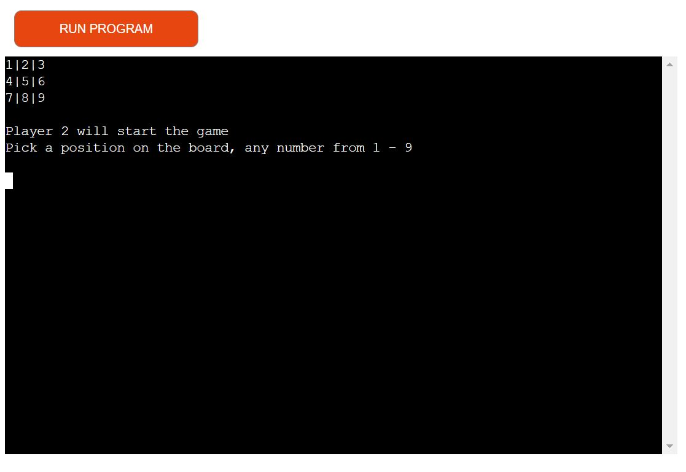
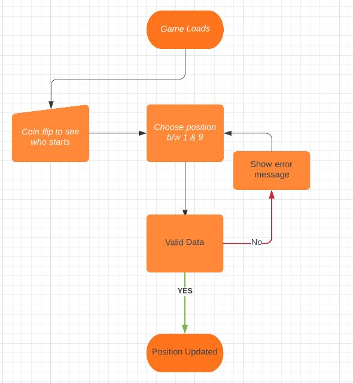
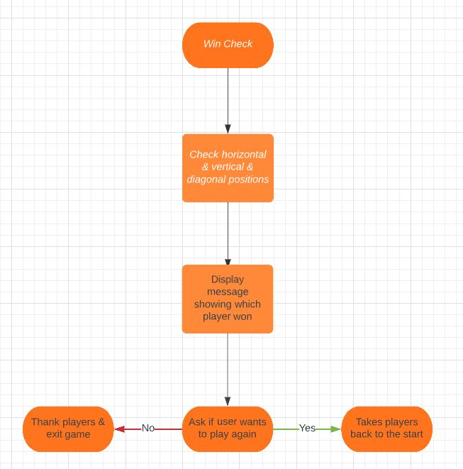

# X's and O's (Tic Tac Toe/Noughts & Crosses)
## Introduction
The aim of this project was to create a site that allowed visitors to play X's and O's (Tic Tac Toe/Noughts and Crosses) against each other.

### Target Audience
* Anyone who wants to play this classic game online instead of using a pen and paper
### User Stories
From a user perspective:
  * I'd like to know which player will start the game
  * I'd like to see the board being updated on every move
  * I'd like to see a message showing if a player picks a position that has already been taken & must pick a different spot
  * I'd like to see a message congratulating the winner or saying the game was a tie
  * I'd like to be asked if I want to play the game again

### Error Handling
Error handling was implemented throughout the development of the game to make sure a player couldn't pick a position that has already been selected and only numbers from one to nine were allowed

## Logical Flow
**Game Flow**



**Win Check**



## Technology
* Python was the only technology used for this application. The were two Python packages utilised during production - os and random.
* OS was used to reset the board 
* Random was used to decide which player starts the game

## PEP8 Validation
All python code was put through https://pep8ci.herokuapp.com/ validator and any warnings were corrected.

## Deployment

### Version Control
The game application was built using codeanywhere and pushed to github to the remote repository
The following git commands were used throughout development to push code to the remote repo:

```git add <file>``` - This command was used to add the files to the staging area before they are committed.

```git commit -m "message"``` - This command was used to commit changes to the local repository queue ready for the final step.

```git push``` - This command was used to push all committed code to the remote repository on github.

### Heroku Deployment

The following steps were followed to deploy the game to Heroku:

* Go to Heroku and click "New" to create a new app.
* Choose an app name and region region, click "Create app".
* Go to "Settings" and navigate to Config Vars. Add the following config variables - PORT : 8000
* Navigate to Buildpacks and add buildpacks for Python and NodeJS, make sure Python pack is on top of NodeJS.
* Navigate to "Deploy". Set the deployment method to Github and enter repository name and connect.
* Scroll down to Manual Deploy, select "main" branch and click "Deploy Branch".
* The app will now be deployed to heroku

### Bugs
When attempting to deploy the game to Heroku, I got the following error:
    * ERROR: Could not find a version that satisfies the requirement python-apt==2.4.0 (from versions: 0.0.0, 0.7.8)
    * ERROR: No matching distribution found for python-apt==2.4.0
I found help on slack where I was directed to remove '==2.4.0' from python-apt as it would install the correct version but this didn't help. I contacted tutor support and after talking through the issue I was recommended to remove everything from the requirements.txt file and deploy the game again. This solved the deployment issue.

## Credits
[Youtube tutorial](https://www.youtube.com/watch?v=Q6CCdCBVypg&ab_channel=CDcodes) & the Udemy course 'The Complete Python Bootcamp From Zero to Hero in Python' - Section 7 -> These tutorials helped with game flow, functions and handling checks for winning combinations.
